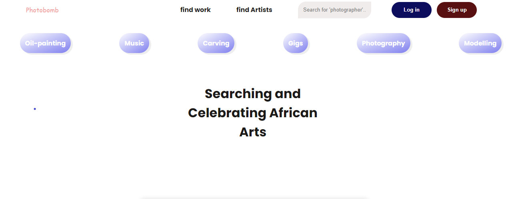

# Photobomb

[Github stars](https://github.com/Olanrewajuemmanuel/photobomb/stargazers)
<big>A Place to search for and celebrate African Arts.
Africa is bustling with a lot of talent and creativity and it will be nice to have a medium for expression</big>

<hr />

# Screenshot



<hr />

# Installation

<p align-"center>It is required for you to have python v3.0.0 and above installed and node v12.0.1 and above</p>

```sh
$ git clone
```

```sh
$ # create virtual environment
$ cd photobomb && virtualenv venv the-name
# source venv by running 'source ./photobomb/Scripts/activate'
```

```sh
$ # install dependencies
$ pip install -r requirements.txt
```

```sh
$ # Run local dev server
$ cd Project && py manage.py runserver

```
<b>Open project at  http://127.0.0.1:8000/photobomb</b>

<p>It is important for you to build the frontend before running, to do so navigate to the frontend/ directory and run

```js
$ yarn build
```

```py
$ py manage.py collectstatic
```

</p>

<hr />

# Contributions

I would love your contributions, I would really like to work with people who can visualize the dream and look pass the ugly work for now :)
Raise issues and fork also, thanks

# Author

<p>My humble self, Lanre. olalerulanre@gmail.com .
</p> 

<small>With love from NG</small>
